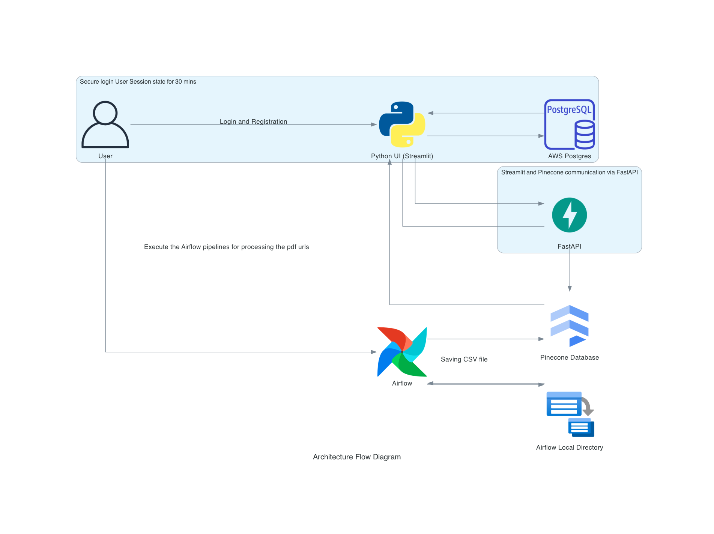

## Application Links

[Codelabs](https://codelabs-preview.appspot.com/?o=driveui&file_id=1AzA4WiiHf_EL82mSxh1edhJs-MB1T8VLiBwJQloeZRA#5)
[Airflow](http://34.138.103.238:8080/home)
[FastAPI](http://34.138.103.238:8000/docs)
[Streamlit](http://34.138.103.238:8090/)


## Abstract:

The project involves two core components: an automated data pipeline using Apache Airflow and a client-facing application built with FastAPI and Streamlit. The goal is to create a comprehensive system that facilitates the acquisition, processing, and storage of data from PDF files, while also providing users with a streamlined interface to query and retrieve information from a Pinecone vector database. 

In the first part, two distinct Airflow pipelines are designed. The first pipeline focuses on data acquisition and embedding generation, enabling users to specify files for processing, processing options. It ensures data accuracy, generates embeddings, and stores metadata in a CSV file. The second pipeline parameterizes the source path of the CSV file for loading into the Pinecone database. It is capable of managing index creation, updates, and deletions when data is refreshed, leveraging Pinecone as a vector database.

The second part involves the creation of a client-facing application using FastAPI and Streamlit. Users can register and securely log in, with JWT authentication protecting API endpoints. Login credentials are stored securely in a SQL database. The application offers a Question Answering interface, enabling users to query information efficiently. Users can choose from a variety of preprocessed forms and input queries. The system performs similarity searches in the Pinecone vector database, ensuring comprehensive results across all items or filtering based on specific forms.

This project combines data automation and user-friendly interfaces, providing a robust solution for data processing, storage, and retrieval in a secure and efficient manner.


## Architecture Diagram:




##Project Structure
```text
Airflow/
├── dags/
│   ├── Deletion.py
│   ├── Pinecone_db.py
│   ├── sandbox.py
├── Embeddings/
│   ├── pdf_data.csv
├── outputs/
│   ├── unique_pdf_names.txt
│   ├── .envExample
│   ├── .gitignore
│   ├── docker-compose.yaml

Fast_API/
├── .DS_Store
├── Dockerfile
├── Procfile
├── egENV.txt
├── embeddings.ipynb
├── main.py
├── requirements.txt

Streamlit/
├── Dockerfile
├── main.py
├── requirements.txt
├── search.py

├── .DS_Store
├── .gitignore
├── README.md
```


## Getting Started

1. Clone the project repository:

   ```bash
   git clone https://github.com/BigDataIA-Fall2023-Team6/Assignment3.git
2. Navigate to the project directory:
    ```bash
   cd Assignment3
3. Create a .env file and add the following environment variables:
   ```bash
   AIRFLOW_UID = XXXX
   OPENAI_KEY = "XXXX"
   PINECONE_API_KEY = "XXXX"
4. Run Docker compose for initializing and running the containers for Airflow, FastAPI and Streamlit.
   ```bash
   docker compose up -d 
5. Watch the docker containers for every 2 seconds:
   ```bash
   watch -n 2 docker ps
6. Once all the Airflow containers are healthy then navigate to the port 8080 i.e. 0.0.0.0:8080
7. Login to the Airflow dashboard.
8. Execute the first DAG "pdf_processing_dag" for generating the embeddings for the 5 pdf urls given by you at the start of this execution and wait till the completion of this pipeline.
9.  Run the second DAG for loading the embeddings and the metadata into the Pinecone vector database and wait till the completion of this pipeline.
10. Head to Pinecone Database and check wheather the embeddings and the metadata are being stored as per the Airflow pipeline execution.
11. Now you can access the main streamlit application which should be running with the help of docker container and you can start using it by registration yourself if you are first time using it and login with your credentials.
12. The login is maintained by session state set to 30mins, hence you will have to login again after 30mins to continue using the application.
13. You can perform semantic search operation or filter through the embeddings and metadata saved on the Pinecone vector database.

### Links 📎
*  Codelab Doc - [link](https://codelabs-preview.appspot.com/?o=driveui&file_id=1AzA4WiiHf_EL82mSxh1edhJs-MB1T8VLiBwJQloeZRA#0)
*  Datasets (SEC.gov) - [link](https://www.sec.gov/forms)


### Tools
* 🔧 Streamlit - [link](https://streamlit.io/)
* 🔧 Airflow - [link](https://airflow.apache.org)
* 🔧 Pinecone - [link](https://app.pinecone.io/organizations/-Nhz-MWGcrFK1PN0RL1Q/projects/gcp-starter:f909f1d/indexes/openaiembeddings00/browser)
* 🔧 PyPDF2 - [link](https://pypdf2.readthedocs.io/en/3.0.0/)
* 🔧 FastAPI - [link](https://github.com/tiangolo/fastapi)
* 🔧 OpenAI - [link](https://github.com/openai/openai-python)
* 🔧 Docker - [link](https://docs.docker.com/get-started/)

## Conclusion

In conclusion, this project represents the culmination of a collaborative effort to design and implement a robust data pipeline and a user-friendly client-facing application. Our goal was to create a comprehensive system that seamlessly handles data acquisition, processing, storage, and retrieval while providing an intuitive interface for users to access and interact with the stored data.

The project comprises two essential components: an automated data pipeline driven by Apache Airflow and a user-facing application built with FastAPI and Streamlit. These components are integrated to offer a holistic solution for handling data from PDF files and facilitating efficient information retrieval.


## Contribution
*   Abhishek : 34`%` 
*   Dilip : 33`%`
*   Vivek : 33`%`

## Team Members 👥
- Abhishek Sand
  - NUID 002752069
  - Email sand.a@northeastern.edu
- Dilip Sharma
  - NUID 002674474
  - Email sharma.dil@northeastern.edu
- Vivek Basavanth Hanagoji
  - NUID 002762662
  - Email hanagoji.v@northeastern.edu

## Individual Distribution

| **Developer** 	|          **Deliverables**          	           |
|:-------------:	|:----------------------------------:	           |
|      Abhishek    	| Semantic and Filtered Search implementation      |
|      Abhishek    	| Fast APIs for PineCone Database                  |
|      Abhishek    	| Docker containerization                          |
|      Abhishek    	| Git setup and integration                        |
|      Vivek      	| Airflow Pipelines                                |
|      Vivek      	| Architecture Diagrams                            |
|      Vivek      	| Fast APIs for PyPDF                              |
|      Dilip      	| UI design for the application                    |
|      Dilip      	| JFT token implementation                         |
|      Dilip      	| Login and Registration                           |
|      Vivek    	| Documentation                                    |


---
---

> WE ATTEST THAT WE HAVEN’T USED ANY OTHER STUDENTS’ WORK IN OUR ASSIGNMENT AND ABIDE BY THE POLICIES LISTED IN THE STUDENT HANDBOOK.

